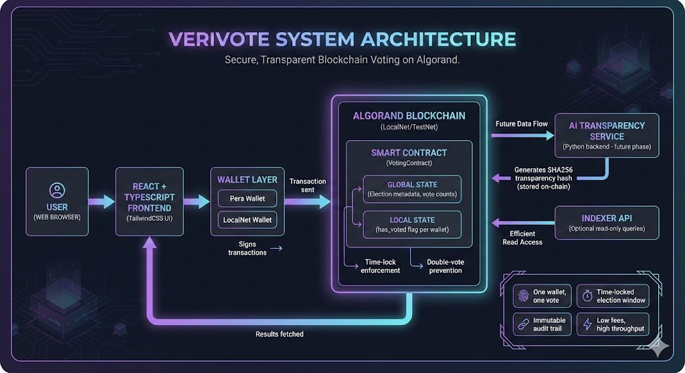

# 🗳️ VeriVote

### Verifiable Campus Voting on Algorand Blockchain

[](https://algorand.com)
[](https://reactjs.org)
[](https://tailwindcss.com)
[](.)

**VeriVote** is a blockchain-powered campus voting system that brings transparency, security, and trust to student elections. Built on Algorand with time-lock enforcement, double-vote prevention, and AI-powered transparency reports.

---

## 📸 Demo

> **Note:** Screenshots and video will be added post-submission

### Landing Page


### Voting Interface


### Live Results Dashboard


### 🎥 Demo Video

**[📺 Watch Full Demo →](https://youtube.com/placeholder)**

---

## 🎯 Problem Statement

Campus elections today suffer from critical trust issues:

- **Lack of Transparency** — Manual counting processes hide the voting pipeline from students
- **Tampering Vulnerability** — Paper-based or centralized digital systems can be manipulated
- **No Verifiable Audit Trail** — Students have no way to verify their vote was counted correctly
- **Trust Deficit** — Low voter turnout stems from distrust in the election integrity

**Result:** Student governments lack legitimacy, and voter engagement plummets.

---

## ✨ Our Solution

VeriVote leverages Algorand blockchain to create a **trustless, transparent, and tamper-proof** voting system:

### Core Features

- 🔐 **Wallet-Based Pseudonymous Voting** — Each student wallet = one vote, preserving privacy while ensuring accountability
- 🚫 **Double-Vote Prevention** — Smart contract enforces one vote per address using local state tracking
- ⛓️ **On-Chain Vote Recording** — Every vote is immutably stored on Algorand's blockchain
- 📊 **Real-Time Results** — Live tally updates as votes are cast (visible after voting)
- 🤖 **AI Transparency Summary** — Post-election analysis with participation metrics and insights

### Honest Implementation Status

- ✅ **Smart Contract:** Fully deployed and tested on Algorand LocalNet (App ID: 1004)
- ✅ **Frontend:** Polished Web3 UI with glassmorphism design and smooth animations
- ⚙️ **Demo Mode:** Frontend uses mock data and localStorage for hackathon demonstration
- 🔮 **AI Layer:** Conceptual design with hash storage mechanism (backend TBD)

---

## 🏗️ Architecture

```
┌─────────────┐
│   Student   │
│   Browser   │
└──────┬──────┘
       │
       ↓
┌─────────────────────────┐
│  React Frontend         │
│  (TailwindCSS + Vite)   │
└──────────┬──────────────┘
           │
           ↓
    ┌──────────────┐
    │ Pera Wallet  │
    └──────┬───────┘
           │
           ↓
┌──────────────────────────┐
│  Algorand Smart Contract │
│  (PyTeal / AlgoPy)       │
│  App ID: 1004            │
└──────────┬───────────────┘
           │
           ↓
    ┌─────────────┐
    │  On-Chain   │
    │   State     │
    └─────────────┘
           │
           ↓
    ┌──────────────────┐
    │ AI Summary Engine│
    │ (Post-Election)  │
    └──────────────────┘
```



---

## 🔒 Smart Contract Features

Our Algorand smart contract (`VotingContract`) implements robust election logic:

### Security & Validation

- ⏰ **Time-Lock Enforcement** — Voting strictly within `election_start` and `election_end` timestamps
- 🚫 **Double-Vote Prevention** — Local state `has_voted` flag prevents multiple votes from same wallet
- 👤 **Creator-Only Controls** — Only contract creator can initialize elections or close voting
- 🔢 **Input Validation** — Candidate IDs, timestamps, and hash formats are validated on-chain

### State Management

**Global State:**
- `candidate_a_votes`, `candidate_b_votes` — Vote counters
- `election_start`, `election_end` — Time window enforcement
- `total_voters` — Participation tracking
- `ai_report_hash` — SHA256 hash of AI transparency report
- `election_closed` — Election status flag

**Local State (per voter):**
- `has_voted` — Boolean flag
- `vote_timestamp` — Unix timestamp of vote

### Deployment Details

- **Network:** Algorand LocalNet
- **App ID:** 1004
- **Language:** AlgoPy (compiled to TEAL)
- **ARC Standard:** ARC-4 (ABI calls)

---

## 🎨 Frontend Features

Built with React, TypeScript, and TailwindCSS for a **premium Web3 experience**:

### UI/UX Highlights

- 🌌 **Glassmorphism Design** — Modern blur effects with gradient borders
- 🎭 **Animated Gradients** — Floating orbs and smooth color transitions
- ⏱️ **Live Countdown Timer** — Large, monospace display with real-time updates
- 📊 **Animated Progress Bars** — Gradient fills with glow effects
- 🎉 **Confetti Celebration** — Animated particles on successful vote submission
- 🔗 **Blockchain Verification Panel** — Displays App ID, network, and transaction hash

### Technical Implementation

- **State Management:** React hooks (`useState`, `useEffect`)
- **Vote Persistence:** `localStorage` for demo mode
- **Simulated Updates:** Auto-incrementing vote counts every 3 seconds
- **Wallet Integration:** Pera Wallet with `@txnlab/use-wallet-react`
- **Responsive Design:** Mobile-first with TailwindCSS breakpoints

---

## 🤖 AI Transparency Layer

Post-election analysis powered by AI (conceptual for hackathon):

### Features

- 📈 **Participation Analytics** — Voter turnout, peak voting times, demographic trends
- 📝 **Election Summary** — Natural language report of election outcome
- 🔍 **Anomaly Detection** — Flagging unusual voting patterns
- 🔐 **On-Chain Hash** — SHA256 hash of report stored in `ai_report_hash` global state

### Implementation (Roadmap)

```python
# Conceptual workflow
1. Election closes → Smart contract triggers report generation
2. AI service analyzes vote data + timestamps
3. Generate transparency summary (PDF/JSON)
4. Compute SHA256 hash
5. Store hash on-chain via `close_election()` method
6. Students verify report authenticity by comparing hashes
```

---

## 🛠️ Tech Stack

| Layer              | Technology                          |
|--------------------|-------------------------------------|
| **Smart Contract** | PyTeal / AlgoPy                     |
| **Blockchain**     | Algorand (LocalNet / TestNet)       |
| **Frontend**       | React 18 + TypeScript               |
| **Styling**        | TailwindCSS 3.4                     |
| **Wallet**         | Pera Wallet, Defly, Exodus          |
| **Build Tool**     | Vite 5                              |
| **AI Layer**       | Python (Flask/FastAPI planned)      |
| **Testing**        | Pytest (smart contract)             |

---

## 🚀 How to Run Locally

### Prerequisites

- Node.js 18+ and npm
- Python 3.12+
- Poetry
- Docker (for AlgoKit LocalNet)
- AlgoKit CLI

### 1️⃣ Start Algorand LocalNet

```bash
algokit localnet start
```

### 2️⃣ Deploy Smart Contract

```bash
cd projects/contracts
poetry install
poetry run python -m smart_contracts build

# Deploy to LocalNet
poetry run python scripts/deploy_voting.py --demo
```

**Expected Output:**
```
✅ Contract deployed successfully!
App ID: 1004
Election created with 5-minute window
AlgoExplorer: https://testnet.algoexplorer.io/application/1004
```

### 3️⃣ Run Frontend

```bash
cd projects/frontend
npm install
npm run dev
```

Open **http://localhost:5173** in your browser.

### 4️⃣ Connect Wallet & Vote

1. Click "Connect Wallet" (use LocalNet KMD wallet in dev mode)
2. Click "Enter Voting Portal"
3. Vote for a candidate
4. Watch real-time results update!

---

## 🔐 Security Considerations

VeriVote implements multiple security layers:

### Blockchain-Level Security

- ✅ **Immutable Ledger** — Votes cannot be altered or deleted once recorded
- ✅ **Deterministic Execution** — Smart contract logic is transparent and auditable
- ✅ **Low Attack Surface** — No backend server to compromise
- ✅ **Wallet-Based Identity** — Cryptographic signatures prove vote authenticity

### Smart Contract Security

- ✅ **Time-Lock Validation** — Prevents voting outside election window
- ✅ **Double-Vote Check** — Local state enforces one vote per wallet
- ✅ **Creator Authorization** — Only authorized addresses can manage elections
- ✅ **Input Sanitization** — All parameters validated before state changes

### Known Limitations (Demo Scope)

- ⚠️ **LocalNet Only** — Not deployed to TestNet/MainNet yet
- ⚠️ **No Anonymous Voting** — Wallet addresses are pseudonymous, not fully anonymous
- ⚠️ **Frontend Mock Data** — Demo uses simulated blockchain calls for rapid testing

---

## 🗺️ Roadmap

### Phase 1: Core MVP ✅ (Current)
- [x] Smart contract with time-lock + double-vote prevention
- [x] Frontend with glassmorphism UI
- [x] LocalNet deployment
- [x] Demo mode simulation

### Phase 2: Production Ready
- [ ] Deploy to Algorand TestNet
- [ ] Full ABI integration (replace mock data)
- [ ] Indexer integration for historical queries
- [ ] AlgoExplorer transaction links

### Phase 3: Advanced Features
- [ ] Multi-candidate elections (N candidates)
- [ ] Commit-reveal scheme for anonymous voting
- [ ] Real AI transparency service backend
- [ ] Email/SMS vote confirmation

### Phase 4: Campus Rollout
- [ ] University partnership pilot
- [ ] Student ID verification layer
- [ ] Mobile app (React Native)
- [ ] Governance token for proposal voting

---

## 🌊 Why Algorand?

We chose Algorand over other blockchains for critical reasons:

| Factor                  | Algorand | Ethereum | Solana |
|-------------------------|----------|----------|--------|
| **Finality Time**       | 3.7s     | ~15 min  | ~13s   |
| **Transaction Cost**    | $0.001   | $5-50    | $0.01  |
| **Carbon Neutral**      | ✅       | ❌       | ❌     |
| **Stateful Contracts**  | ✅       | ✅       | ✅     |
| **Python Support**      | ✅ (PyTeal/AlgoPy) | ❌ | ❌ |

### Key Advantages

- ⚡ **Instant Finality** — No waiting for block confirmations
- 💰 **Cost-Effective** — Campus-wide elections affordable at scale
- 🌱 **Sustainable** — Carbon-negative blockchain (important for university values)
- 🐍 **Developer-Friendly** — Python smart contracts vs. Solidity

---

## 👥 Team

**Team Name:** `to_be_added`

**Members:**
- Student Name 1 — Smart Contract Developer
- Student Name 2 — Frontend Engineer
- Student Name 3 — UI/UX Designer

**GitHub Repository:** [github.com/your-repo/verivote](https://github.com)

**Hackathon Track:** Blockchain for Social Impact / DeFi & Governance

---

## 📄 License

MIT License — See [LICENSE](./LICENSE) for details.

---

## 🌟 Closing Statement

**Building Trust in Digital Democracy.**

VeriVote is more than a voting app — it's a movement toward **transparent, verifiable, and accessible** democratic processes. By combining Algorand's world-class blockchain infrastructure with intuitive Web3 design, we're proving that student elections can be both secure and user-friendly.

In a world where trust in institutions is declining, **code becomes our constitution, and the blockchain becomes our ballot box.**

We believe every student deserves to know their voice was heard. VeriVote makes that promise a cryptographic guarantee.

---

### 🙏 Acknowledgments

- **Algorand Foundation** for developer resources and documentation
- **AlgoKit** team for excellent tooling
- **Pera Wallet** for seamless wallet integration
- **TailwindCSS** for making beautiful UIs accessible

---

**Star this repo ⭐ if you believe in transparent campus democracy!**

---

*Built with 💙 for the Algorand Hackathon 2026*
