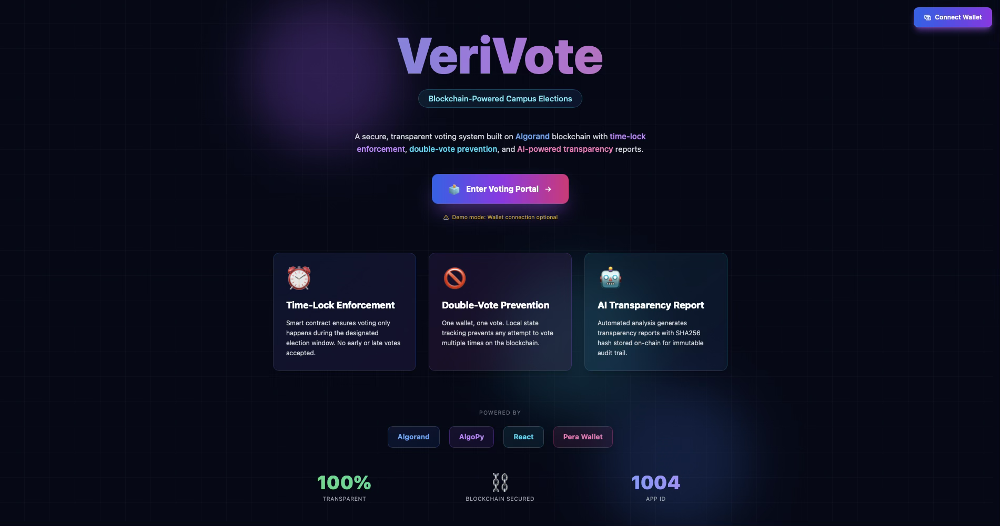
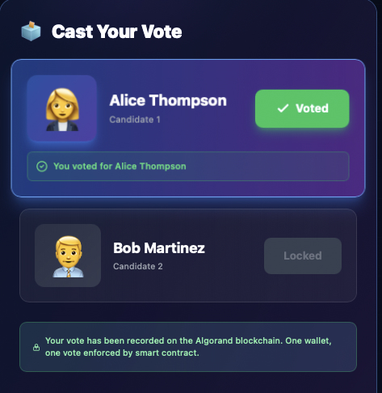
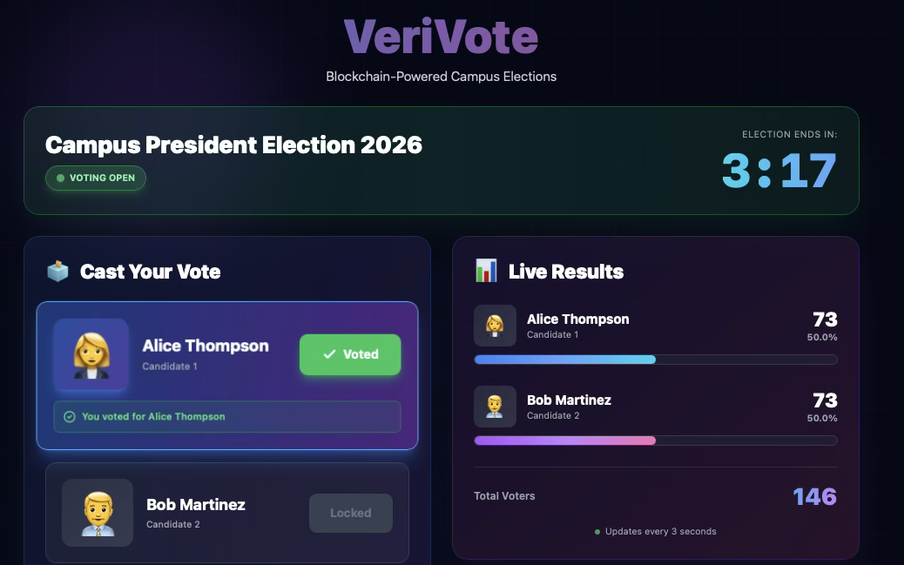
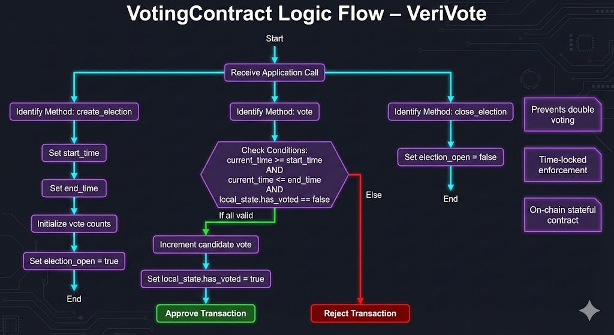

# VeriVote

**Verifiable campus voting on Algorand blockchain**

---

## Demo








## 🎥 Demo Video

<video src="./docs/videos/demo.mp4" controls width="800"></video>

Or download directly:

[Download Demo Video](./docs/videos/demo.mp4)


---

## Problem

- Campus elections lack transparency and verifiable audit trails
- Manual/centralized systems are vulnerable to tampering
- Students don't trust election results

---

## Solution


- **Blockchain-verified voting** — Every vote immutably recorded on Algorand
- **Double-vote prevention** — Smart contract enforces one vote per wallet using local state
- **Time-lock enforcement** — Voting only allowed during election window
- **On-Chain Verification Panel** — Displays App ID and network for transparency
- **Real-time results** — Live vote tallying with on-chain verification

---

## Architecture





```
Student → React/Wallet → Algorand Smart Contract → On-Chain State
                                ↓
                         AI Summary (hash stored)
```


---

## Smart Contract

**App ID:** `1004` (Algorand LocalNet)

**Global State:** `candidate_a_votes`, `candidate_b_votes`, `election_start`, `election_end`, `total_voters`, `ai_report_hash`, `election_closed`

**Local State:** `has_voted`, `vote_timestamp`

**Security:**
- Time-window validation (no voting outside election period)
- Double-vote check via local state flag
- Creator-only election management
- Immutable vote records

---

## Tech Stack

| Layer | Technology |
|-------|------------|
| Smart Contract | AlgoPy (TEAL) |
| Blockchain | Algorand LocalNet |
| Frontend | React + TypeScript + Vite |
| Styling | TailwindCSS |
| Wallet | Pera Wallet |

---

## How to Run

```bash
# Start LocalNet
algokit localnet start

# Deploy Contract
cd projects/contracts
poetry install
poetry run python scripts/deploy_voting.py --demo

# Run Frontend
cd projects/frontend
npm install
npm run dev
```

Open `http://localhost:5173`

---

## Status

**Live:**
- ✅ Smart contract deployed (App ID: 1004)
- ✅ Full test suite passing
- ✅ Glassmorphism UI with wallet integration

**Demo Mode:**
- Frontend uses mock data + localStorage
- Real blockchain integration planned for TestNet

---

## Roadmap

- Deploy to Algorand TestNet/MainNet
- Full ABI integration (replace mock calls)
- AI transparency service backend
- Multi-candidate elections
- Anonymous voting (commit-reveal)
- Mobile app

---

**MIT License • Built for Algorand Hackathon 2026**
